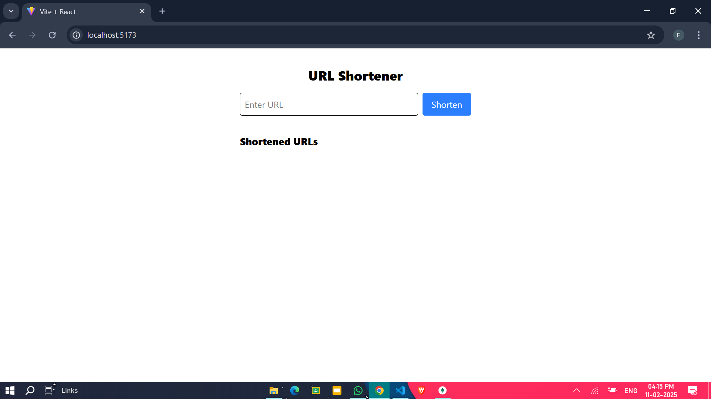
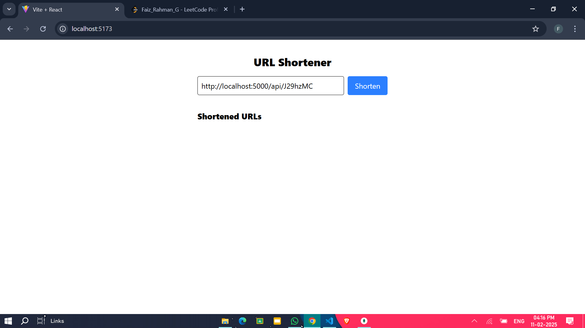
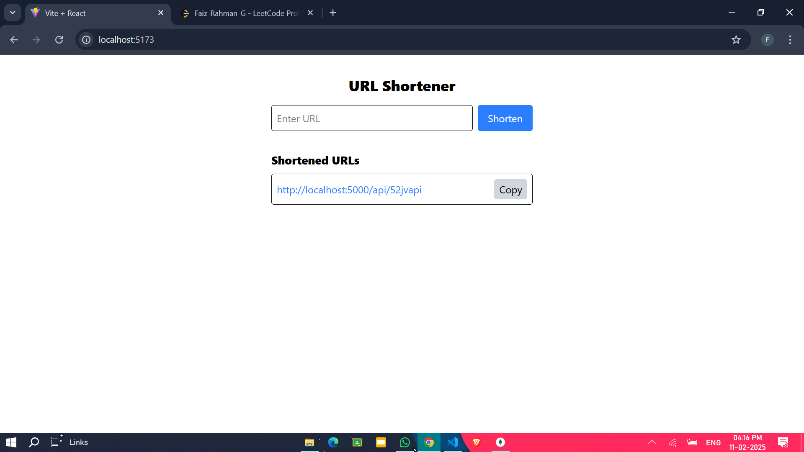
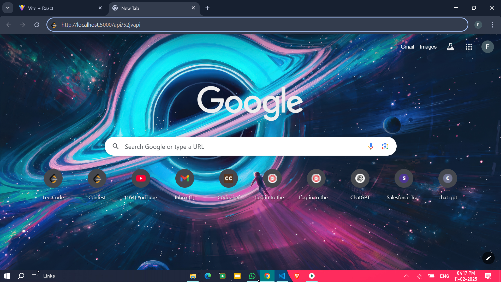
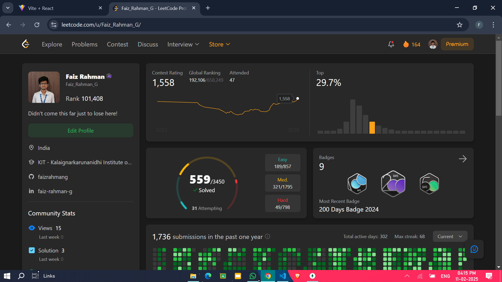

# URL Shortener

A simple URL shortener built using **MERN stack** with Tailwind CSS.

## Screenshots

### Main Page


### URL Input


### Shortened URL Generated


### Opening the Shortened URL
#### Entering the URL:


#### Redirected to Website:


## Features
- Shorten long URLs
- Copy shortened links easily
- Redirect to the original URL

## Installation
1. Clone the repository
   ```sh
   git clone https://github.com/your-username/url-shortener.git
   cd url-shortener
   ```
2. Install backend dependencies
    ```sh
    cd backend
    npm install
    npm run dev
    ```
3. Install frontend dependencies
    ```sh
    cd frontend
    npm install
    npm run dev
    ```
4. Open ```http://localhost:5173``` in your browser.


